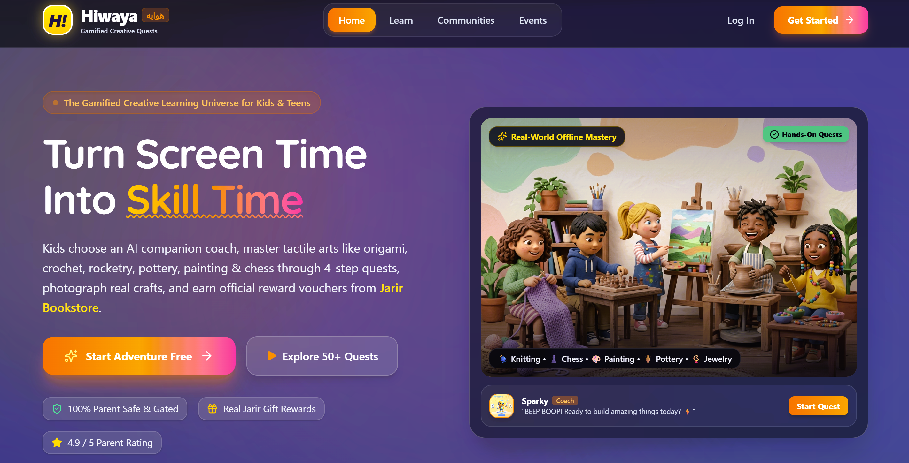
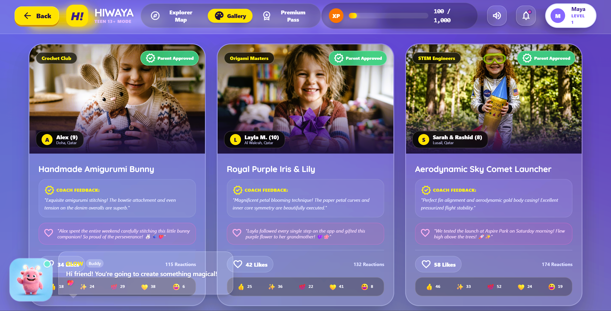

# Hiwaya — Screen Time to Skill Time

> *This is a demonstration version built during a Hackathon. Some features, including premium purchases, are not enabled.*



**Hiwaya (هواية)** is a gamified, safe, and interactive creative learning platform designed for kids and teens in Qatar. Learners embark on hands-on craft adventures—spanning Origami, Crochet, Painting, STEM Rocketry, Calligraphy, and Junior Finance—guided by animated AI companions, structured video masterclasses, interactive drawing pads, and intelligent project evaluation.

---

## Live Demo

**Production URL:** `https://hiwaya.vercel.app/`

---

## 🌟 Key Features

* **🗺️ Interactive Quest Adventure Map**: Progression-based learning tracks with sequential quests, prerequisite locks, XP milestones, and level progression.
* **🤖 AI Creative Companion & Live Coach**: Interactive, animated companions (Sparky, Luna, Pip, and Barnaby) providing real-time voice prompts, hints, and encouragement.
* **📸 Project Verification & AI Feedback**: Learners can submit camera photos or custom digital drawings of their physical creations to receive instant, encouraging AI feedback and dexterity scoring.
* **👨‍👩‍👧 Comprehensive Parent Hub**: A PIN-protected command center with time limits, moderation queues for child gallery submissions, hobby category controls, and activity logs.
* **🎨 Teen Maker Mode (13+)**: Tailored interface for teens with direct community gallery publishing, advanced skill metrics, and streamlined navigation without parental gates.
* **🏆 Tangible Rewards & Partner Vouchers**: Milestone achievements unlock digital badges, certificates, and real-world vouchers redeemable with partner brands (e.g., Alif Stories, Jarir Bookstore, Virgin Megastore, Hobby Haven).
* **🔒 Course Paywall & Gating**: Free starter access to Origami and Crochet, with strict paywall protection and clear upgrade pathways for premium courses (Painting, STEM Rocketry, Pottery, Calligraphy).
* **🎉 Immersive Visual & Audio FX**: Web Audio API sound effects, canvas confetti celebrations, glowing shader backgrounds, and tactile micro-interactions.

---

## 🖼️ Platform Walkthrough & Screenshots

|### Explorer Map (Homepage)|### Gallery|### Parent Hub|
|---|---|---|
|||| 

---

## 🛠️ Tech Stack

* **Frontend Framework**: React 19 (Functional components, custom hooks)
* **Language**: TypeScript 5.8 (Strict type safety)
* **Styling**: Tailwind CSS v4 (Modern responsive utility system)
* **Animations**: Motion (`motion/react`) & Canvas Confetti
* **AI Integration**: `@google/genai` (Server-side Google Gemini SDK)
* **Audio Synthesis**: Native Web Audio API procedural sound engine
* **Icons**: Google Material Symbols & Lucide React
* **Build Tool**: Vite 6

---

## 🚀 Setup & Local Development

### Prerequisites
* Node.js (v18 or higher recommended)
* npm or bun

### Installation

1. **Clone the repository and install dependencies**:
   ```bash
   npm install
   ```

2. **Configure Environment Variables** *(optional for local dev)*:
   Create a `.env` file based on `.env.example`:
   ```env
   GEMINI_API_KEY=your_gemini_api_key_here
   ```

3. **Start the Development Server**:
   ```bash
   npm run dev
   ```
   The application will be accessible at `http://localhost:3000`.

4. **Production Build**:
   ```bash
   npm run build
   ```

5. **Type Checking & Linting**:
   ```bash
   npm run lint
   ```

---

## 👥 Demo Accounts & Quick Switch

Hiwaya includes pre-configured profiles accessible from the login screen:

| Role | Demo Email | Default Password | Experience |
|---|---|---|---|
| **Parent** | `parent@hiwaya.qa` | `password123` | Full access to Parent Hub, PIN controls, moderation queues, and child accounts. |
| **Teen (13+)** | `maya@hiwaya.qa` | `password123` | Direct gallery publishing, teen maker dashboard, unlocked advanced tracks. |
| **Child Learner** | `alex@hiwaya.qa` | `password123` | Gamified quest map, companion guidance, moderated parent approval flow. |

> **Tip**: You can also use the **Role Switcher** in the top navigation bar to instantaneously toggle between roles for testing.

---

## 📖 How to Use the Platform

1. **Sign Up or Log In**: Choose your explorer role (Parent, Teen, or Child) and select your starting AI companion.
2. **Explore the Quest Map**: Select an active hobby track (Origami, Crochet, etc.) and tap on an unlocked quest node.
3. **Learn & Create**: Watch the video tutorial, follow the checklist steps, or use the digital drawing pad.
4. **Submit for AI Evaluation**: Take a photo or upload artwork to receive encouraging feedback and XP.
5. **Unlock Milestones & Vouchers**: Complete courses to earn digital achievement badges and redeem partner vouchers.
6. **Parental Management**: Parents enter their 4-digit PIN (default `1234`) to review completed crafts, adjust screen time, and approve community gallery uploads.

---

## 📄 License

This project is licensed under the MIT License.
